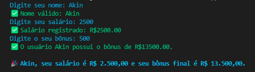

# 🧠 Desafios Jornada de Dados

Bem-vindo(a) ao repositório de desafios da **Jornada de Dados**! 🚀  
Aqui você encontrará exercícios em **Python**, focados em lógica de programação voltada para **dados**, onde fui evoluindo e refatorando o código conforme aprendia novos conceitos.

---

## 📋 Proposta do Programa

A proposta principal dos desafios é simular um pequeno sistema que calcula o **KPI de bônus** de um colaborador, com base nas informações inseridas. O fluxo do programa é:

1. ✏️ Solicita o **nome** do usuário  
2. 💰 Solicita o **salário base** (convertido para `float`)  
3. 🎁 Solicita o **bônus recebido** (convertido para `float`)  
4. 🧮 Calcula o **valor do bônus final**  
5. 📊 Imprime o cálculo do **KPI**  
6. 💬 Exibe uma **mensagem personalizada** com nome, salário e bônus  

---

## ⚙️ Tecnologias e Conceitos Utilizados

- 🐍 **Python 3**
- 🧱 Lógica de programação
- 🔄 Conversão de tipos (`input`, `float`, `str`)
- 🧼 Refatoração de código com **funções**
- 💻 Configuração de ambiente com **pyenv** no **Windows**

---

## 📁 Estrutura do Repositório

O repositório está organizado em arquivos que representam a evolução dos desafios:

```bash
📦 desafios-jornada-de-dados/
├── desafio_1.py       # Versão inicial do programa
├── desafio_2.py       # Refatoração com funções
├── desafio_3.py       # Melhorias e novas abordagens
└── ...


📌 Exemplo de Saída Esperada:


📚 Aprendizados

Durante o desenvolvimento desses desafios, aprendi e pratiquei:

✅ Lógica de programação com Python
✅ Entrada e conversão de dados com input() e float()
✅ Uso e organização do código com funções
✅ Formatação de mensagens personalizadas
✅ Boas práticas de escrita e refatoração de código
✅ Configuração do ambiente com pyenv no Windows
✅ Execução de scripts diretamente pelo terminal

Feito com 💙 por @AkinRigo